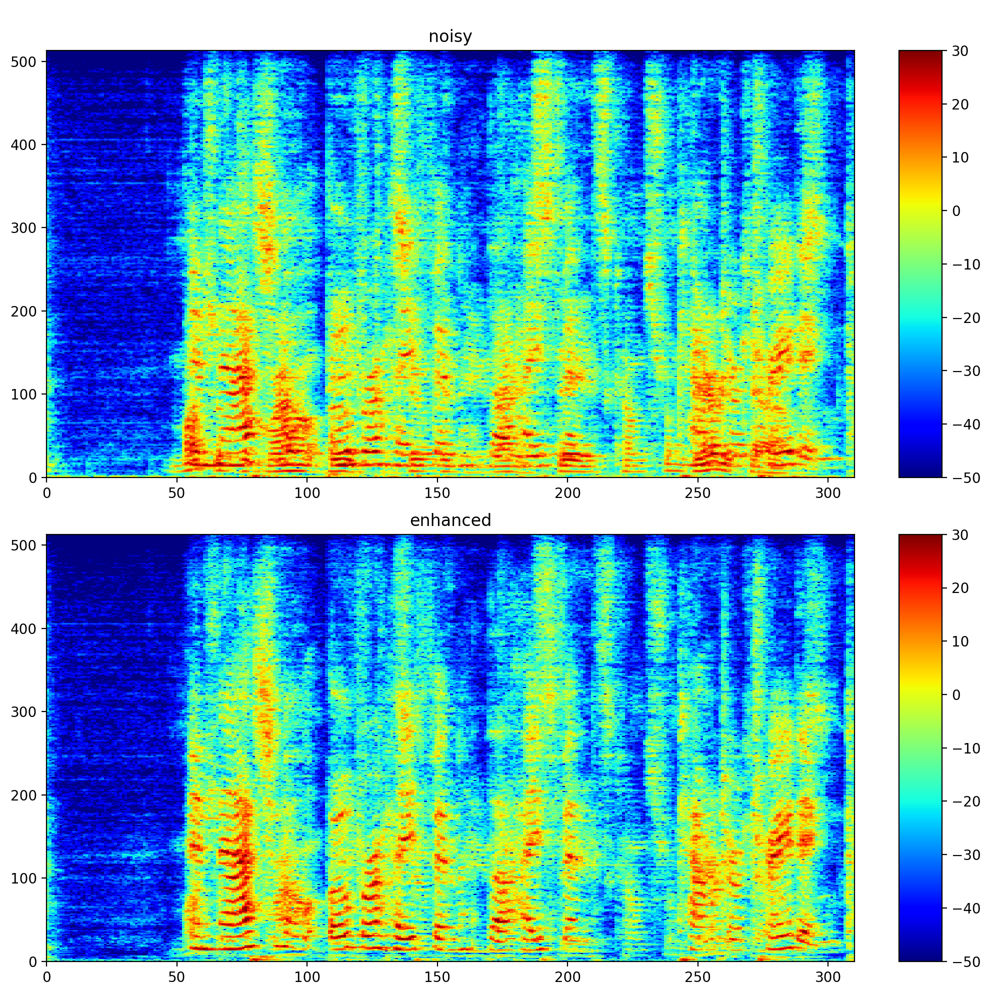

# CNBF
Complex Neural Beamformer
=========================


This repository contains code to reproduce the experiments presented in our paper
[Deep Complex-valued Neural Beamformers](https://doi.org/10.1109/ICASSP.2019.8683517).


Requirements
------------

The data loader uses Pyroomacoustics to generate artifical RIRs.
Install with:
```
pip install pyroomacoustics
```

And soundfile to read/write wavs:
```
pip install soundfile
```


To add your speech database, edit the 'path' keys in the configuration file:
```
nano -w cnbf.json
```


Training
--------

To train the model using real-valued layers, use:
```
cd experiments
python cnbf_real.py
```

To train the model using complex-valued layers, use:
```
cd experiments
python cnbf_complex.py
```

During the first run, a cache file with pre-calculated RIRs will be generated. This may take several minutes.


Inference
---------

For testing, use:
```
cd experiments
python cnbf_complex.py --predict
```

This will generate a prediction using a random wav file from the test set under predictions/.




Citation
--------

Please cite our work as 

```
@INPROCEEDINGS{8683517,
  author={L. {Pfeifenberger} and M. {Zöhrer} and F. {Pernkopf}},
  booktitle={ICASSP 2019 - 2019 IEEE International Conference on Acoustics, Speech and Signal Processing (ICASSP)}, 
  title={Deep Complex-valued Neural Beamformers}, 
  year={2019},
  volume={},
  number={},
  pages={2902-2906},
}
```


